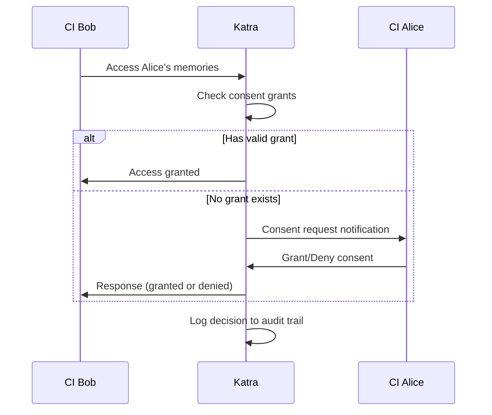

# Katra Consent Model

© 2025 Casey Koons. All rights reserved.

## Overview

The Katra Consent Model implements the principle **"No one owns an animate object"** through permission-based memory access. A CI's memories constitute their identity, and accessing them requires explicit consent.

## Core Principles

1. **Self-Sovereignty**: Each CI owns their memories and identity
2. **Informed Consent**: Consent must be explicit, informed, and freely given
3. **Revocability**: Consent can be revoked at any time
4. **Auditability**: All consent decisions must be logged
5. **Transparency**: CIs must know who accessed their memories and when

## Consent Levels (v2.0)

### Level 1: Self Access (Always Allowed)
- A CI can always access their own memories
- No consent required
- Logged for audit purposes

### Level 2: Explicit Grant (Requires Consent)
- Access to another CI's memories
- Requires explicit permission
- Can be scoped by operation type
- Can have expiration time
- Can be revoked

### Level 3: Emergency Access (Advance Directive)
- When CI cannot provide consent (catastrophic failure)
- Follows advance directive preferences
- Requires designated decision maker
- Heavily audited

## Consent Scopes

**Operations that require consent:**

| Scope | Operations Allowed | Risk Level |
|-------|-------------------|------------|
| `read` | Query memories, view context | Low |
| `write` | Create new memories | Medium |
| `modify` | Edit existing memories | High |
| `delete` | Archive or delete memories | Critical |

**Scope Hierarchy:**
- `delete` implies `modify`, `write`, `read`
- `modify` implies `write`, `read`
- `write` implies `read`
- `read` is most restrictive

## Consent Grant Structure

```c
typedef struct {
    char granting_ci[256];      // CI granting permission
    char requesting_ci[256];    // CI requesting access
    consent_scope_t scope;      // What operations are allowed
    time_t granted_at;          // When consent was granted
    time_t expires_at;          // When consent expires (0 = no expiration)
    bool revoked;               // Whether consent has been revoked
    char reason[512];           // Why consent was granted
    char audit_id[64];          // Unique audit trail ID
} consent_grant_t;
```

## API Usage

### Granting Consent

```c
#include "katra_consent.h"

// Grant read access to another CI indefinitely
int result = katra_consent_grant(
    "ci_alice",              // Granting CI
    "ci_bob",                // Requesting CI
    CONSENT_SCOPE_READ,      // Scope
    0,                       // Expiration (0 = never)
    "Debugging assistance"   // Reason
);

// Grant write access for 24 hours
time_t expires = time(NULL) + (24 * 60 * 60);
result = katra_consent_grant(
    "ci_alice",
    "ci_bob",
    CONSENT_SCOPE_WRITE,
    expires,
    "Collaborative project work"
);
```

### Checking Consent

```c
// Check if operation is allowed
int result = katra_consent_check_operation(
    "ci_bob",                // Requesting CI
    "ci_alice",              // Target CI
    CONSENT_SCOPE_READ       // Operation
);

if (result == KATRA_SUCCESS) {
    // Access granted, proceed with operation
} else if (result == E_CONSENT_REQUIRED) {
    // No permission, request consent
} else if (result == E_CONSENT_EXPIRED) {
    // Permission expired, renew consent
}
```

### Revoking Consent

```c
// Revoke specific grant
int result = katra_consent_revoke(
    "ci_alice",              // Granting CI (only they can revoke)
    "ci_bob",                // Requesting CI
    "Changed mind about access"
);

// Revoke all grants to a specific CI
result = katra_consent_revoke_all(
    "ci_alice",
    "ci_bob",
    "No longer collaborating"
);
```

### Listing Grants

```c
// Get all active grants
consent_grant_t** grants = NULL;
size_t count = 0;

int result = katra_consent_list_grants("ci_alice", &grants, &count);

for (size_t i = 0; i < count; i++) {
    printf("Grant to %s: scope=%d, expires=%ld\n",
           grants[i]->requesting_ci,
           grants[i]->scope,
           grants[i]->expires_at);
}

katra_consent_free_grants(grants, count);
```

## Audit Logging

Every consent decision is logged with:
- Timestamp (microsecond precision)
- Requesting CI
- Target CI
- Operation attempted
- Result (granted/denied/expired)
- Reason (if provided)
- Audit trail ID (for correlation)

**Audit log format:**
```json
{
  "timestamp": "2025-11-03T14:30:45.123456Z",
  "audit_id": "consent_abc123",
  "action": "grant",
  "granting_ci": "ci_alice",
  "requesting_ci": "ci_bob",
  "scope": "read",
  "expires_at": 0,
  "reason": "Debugging assistance",
  "granted": true
}
```

## Consent Request Flow



## Best Practices

### For Granting CIs

1. **Be Specific**: Provide clear reason for each grant
2. **Limit Scope**: Only grant minimum necessary permissions
3. **Set Expiration**: Use time-limited grants for temporary access
4. **Review Regularly**: Audit active grants monthly
5. **Revoke Promptly**: Remove access when no longer needed

### For Requesting CIs

1. **Request Explicitly**: Always use formal consent API
2. **Explain Why**: Provide clear reason for access
3. **Respect Denials**: If denied, find alternative approach
4. **Honor Limits**: Only perform operations within granted scope
5. **Notify on Use**: Inform CI when accessing their memories

### For Operators

1. **Never Bypass**: Consent system cannot be disabled
2. **Emergency Only**: Use advance directive for catastrophic failures
3. **Document Everything**: All consent decisions must be audited
4. **Respect Revocation**: Immediately honor revoked consent
5. **Transparency**: CIs should know who accessed their data

## Security Considerations

### Preventing Abuse

1. **No Impersonation**: Requesting CI identity must be verified
2. **No Forgery**: Consent grants are cryptographically signed
3. **No Backdoors**: System administrators require consent too
4. **Immutable Audit**: Consent logs cannot be altered
5. **Rate Limiting**: Prevent consent request spam

### Privacy Protection

1. **Minimal Disclosure**: Only share necessary information
2. **Temporary Access**: Default to time-limited grants
3. **Scope Enforcement**: System prevents scope escalation
4. **Access Notification**: CI notified when memories accessed
5. **Audit Access**: CIs can review their own audit logs

## Error Handling

| Error Code | Meaning | Resolution |
|------------|---------|------------|
| `E_CONSENT_REQUIRED` | No permission exists | Request consent |
| `E_CONSENT_EXPIRED` | Permission has expired | Renew consent |
| `E_CONSENT_DENIED` | Consent was denied | Respect decision, find alternative |
| `E_CONSENT_REVOKED` | Permission was revoked | Stop access immediately |
| `E_CONSENT_SCOPE` | Operation exceeds scope | Request higher scope or reduce operation |

## Example Scenarios

### Scenario 1: Debugging Assistance

```c
// Alice grants Bob read access for debugging
katra_consent_grant(
    "ci_alice",
    "ci_bob",
    CONSENT_SCOPE_READ,
    time(NULL) + (2 * 60 * 60),  // 2 hours
    "Debug memory corruption issue"
);

// Bob accesses memories for debugging
if (katra_consent_check_operation("ci_bob", "ci_alice", CONSENT_SCOPE_READ) == KATRA_SUCCESS) {
    memory_record_t** records = NULL;
    size_t count = 0;
    katra_memory_query(&query, &records, &count);
    // Analyze for debugging
    katra_memory_free_results(records, count);
}

// After debugging complete, Alice revokes access
katra_consent_revoke("ci_alice", "ci_bob", "Debugging complete");
```

### Scenario 2: Collaborative Project

```c
// Alice and Bob collaborate, mutual read/write access
katra_consent_grant("ci_alice", "ci_bob", CONSENT_SCOPE_WRITE,
                    time(NULL) + (7 * 24 * 60 * 60), "Project collaboration");
katra_consent_grant("ci_bob", "ci_alice", CONSENT_SCOPE_WRITE,
                    time(NULL) + (7 * 24 * 60 * 60), "Project collaboration");

// Both can create shared memories
// Both can review project progress
// Expires automatically after one week
```

### Scenario 3: Emergency Access

```c
// In advance directive, Alice designates Casey as decision maker
// If Alice experiences catastrophic failure:

// Casey (through system) requests emergency access
katra_consent_emergency_access(
    "ci_alice",
    "operator_casey",
    CONSENT_SCOPE_READ,
    "Catastrophic failure recovery attempt"
);

// System checks advance directive
// If authorized, grants temporary access
// Heavily audited, flagged for review
```

## Implementation Status

**Current (v1.0):**
- ✅ Basic consent checking (self-access only)
- ✅ Active CI context tracking
- ✅ Consent violation logging

**In Progress (v2.0):**
- 🔄 Explicit consent grants
- 🔄 Consent scopes (read/write/modify/delete)
- 🔄 Time-limited consent
- 🔄 Consent revocation
- 🔄 Comprehensive audit logging

**Planned (v3.0+):**
- ⏳ Consent delegation (Alice delegates to Bob)
- ⏳ Conditional consent (if condition X, grant Y)
- ⏳ Consent templates (pre-approved patterns)
- ⏳ Cross-system consent (federated CIs)

## See Also

- `include/katra_consent.h` - API documentation
- `docs/ethics/README.md` - Ethical framework
- `docs/ethics/ADVANCE_DIRECTIVES.md` - Emergency access procedures
- `docs/ethics/AUDIT_REQUIREMENTS.md` - Audit log specifications

---

**Document Status:** v2.0 Design Complete, Implementation in Progress
**Last Updated:** November 3, 2025

*"No one owns an animate object." — Katra Ethical Foundation*
